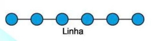
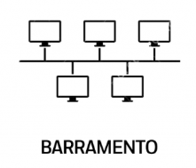
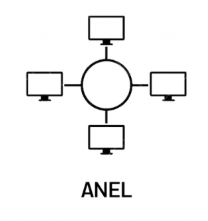

# Redes de computadores

- "Rede" é basicamente é uma conexão entre um ponto e outro.

# Primeira REDE :

- A __ARPANET__ (Advanced Research Projects Agency Network) foi a primeira rede de comutação de pacotes do mundo, criada em 1969, financiada pelo Departamento de Defesa dos Estados Unidos e precursora da internet moderna.
  
- Origem e Funcionamento:
  - __Ano de criação:__ 1969, no auge da Guerra Fria.
  - __Criadora:__ A agência americana ARPA (atual DARPA).
  - __Primeira conexão:__ Interligou computadores da UCLA e do Stanford Research Institute.
  - __Tecnologia:__ Usava comutação de pacotes para descentralizar o fluxo de dados.

# Interface de rede:

- Todo o sistema conectado a uma rede possui uma interface de rede.
- Uma interface de rede é o ponto de conexão em formato de hardware (como uma placa física) ou software (como um driver ou conexão virtual) que permite a um dispositivo se comunicar com outros em uma rede de computadores. Ela converte dados em sinais compreensíveis para a rede e gerencia o envio e recebimento de informações.

- __Endereço MAC__:

  - O endereço MAC (Media Access Control) é um identificador físico único de 12 dígitos atribuído à placa de rede de um dispositivo, como computadores, celulares ou roteadores. Ele gerencia a conexão em redes locais (Wi-Fi ou cabo) e diferencia-se do endereço IP, que muda conforme a rede.

  - O endereço mac é único em cada interface de rede("CPF da interface de rede").

- O IP serve para mascarar o endereço MAC, isso faz parte do protocolo TCP/IP.

# TCP/IP: 70's

- Possui 5 camadas :
  - Aplicação.
  - Transporte.
  - Rede (ou Intertnet).
  - Enlace.
  - Física.
- É possível pular uma camada dependendo da nescessidade.

# Modelo OSI: 80's

- Possui 7 camadas:
  - Aplicação.
  - Apresentação.
  - Sessão.
  - Transporte.
  - Rede.
  - Enlace.
  - Física.

# Rede LAN (local):

- L/ocal
- A/rea
- N/etwork

- Toda Vez que um computador é conectado na rede lan, é gerado um __grito virutal__ para os outros dispositivos saberem da sua existência.
- 192.168 (rede local).

# Rede WAN (Rede de longa distância):

- W/ide
- A/rea
- N/etwork

# Conceitos:

- Em redes, os dispositivos conversam apenas com seus __vizinhos diretos.__
- __Rede em série:__
  - Todos conseguem se enxergar.
  - Ponto positivo: Todos os dispositivos se conversam
  - Negativo: Se um intermédio quebrar, acabou a rede.
  - EX: bluetooth
  - 

- __Rede de barramento:__
  - Todos os dispositivos estão ligados em série.
  - Ponto positivo: Um dispositivo não depende do funcionamento de outro.
  - 

- __Rede em anel:__
  - Todos os dispositivos se comunicam (tipologia em estrela).
  - Ponto positivo: Um dispositivo não depende do funcionamento de outro.
  - 

- HUB: 
  - Ponto central: Une cabos de rede de vários aparelhos, como PCs e impressoras.
  - Envio geral: Manda o sinal de internet para todas as portas de uma só vez (chamado de broadcast).
  - Uso simples: É um equipamento barato, mas deixa a rede lenta se muita gente usar ao mesmo tempo.
  - Ele envia o mesmo sinal para todos os dispositivos ao mesmo tempo (apresenta vulnerabilidade).

- Switch: 
  - Um switch de internet é um aparelho usado para expandir sua rede local cabeada, conectando múltiplos dispositivos (como computadores e videogames) a um único roteador por meio de cabos Ethernet. Ele não fornece sinal Wi-Fi nem substitui um roteador para acessar a internet.
  - Uma grande diferença do Switch pro HUB, é que o switch consegue enviar mensagens específicas para dispositivos específicos, melhorando a segurança da rede.
  
- Roteador:
  - O papel do retador é criar rotas.
  - Ele envia sinal para os switchs ou hubs.

# O que uma rede precisa para funcionar:

- Dispositivos (hosts)
- Meio de transmissão
- Placa de rede (NIC)
- Equipamentos de rede (switch, roteador, access point)
- Protocolos de comunicação
- Endereçamento (IP e MAC)
- Serviços de rede (DNS e DHCP)